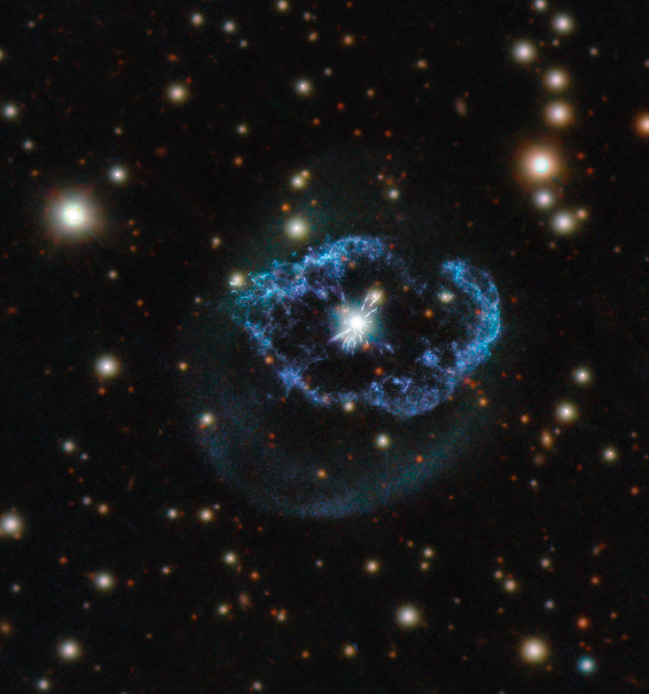

 

Located around 5,000 light-years away in the constellation of Cygnus (the Swan), Abell 78 is an unusual type of planetary nebula.

## Re-energized Planetary Nebula

After exhausting the nuclear fuel in their cores, stars with a mass of around 0.8 to eight times the mass of our Sun collapse to form dense and hot white dwarf stars. As this process occurs, the dying star will throw off its outer layers of material, forming an elaborate cloud of gas and dust known as a planetary nebula. This phenomenon is not uncommon, and planetary nebulae are a popular focus for astrophotographers because of their often beautiful and complex shapes. However, a few like Abell 78 are the result of a so-called “born again” star.

Although the core of the star has stopped burning hydrogen and helium, a thermonuclear runaway at its surface ejects material at high speeds. This ejecta shocks and sweeps up the material of the old nebula, producing the filaments and irregular shell around the central star seen in this image, which features data from Hubble’s Wide Field Camera 3 and the Panoramic Survey Telescope and Rapid Response System.

 
