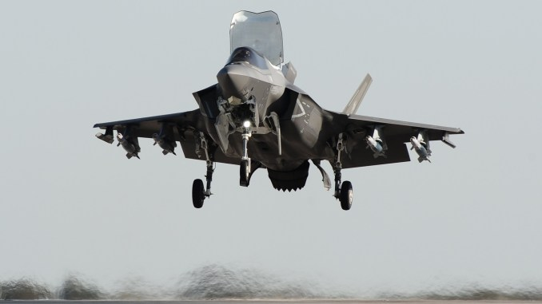
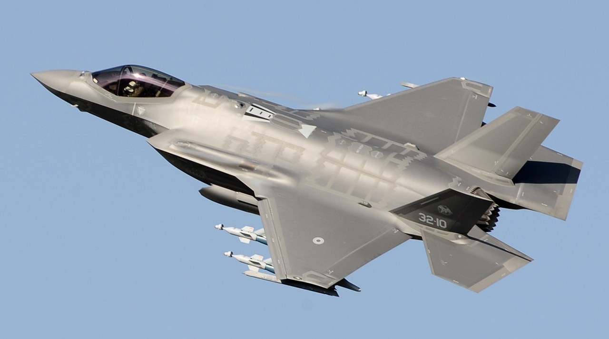
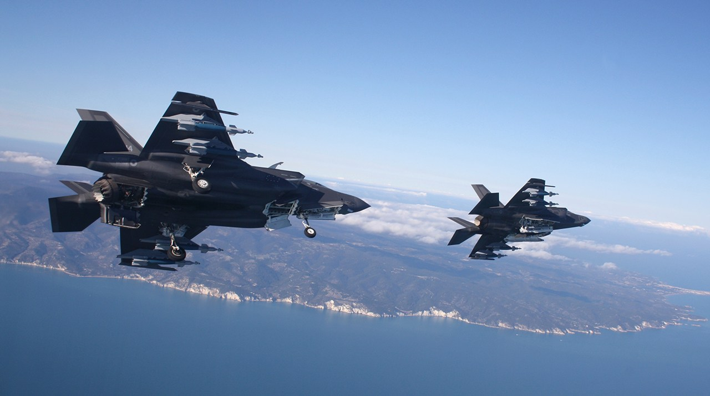
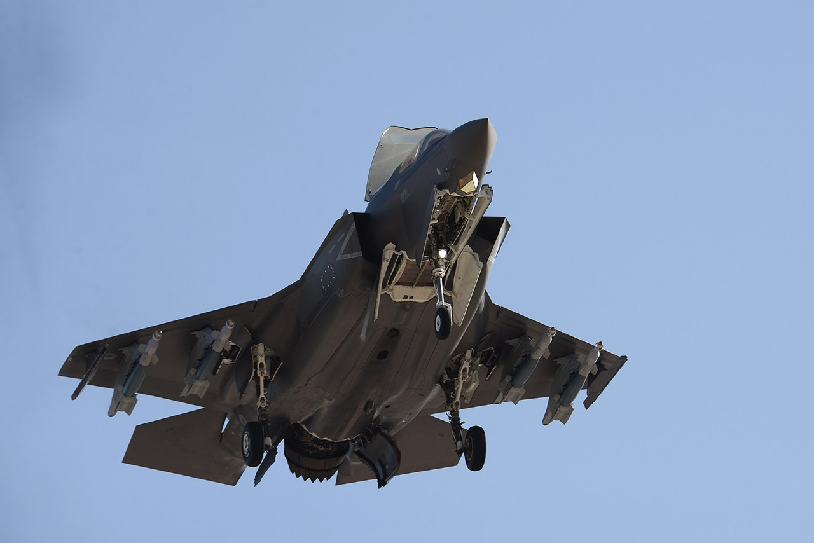
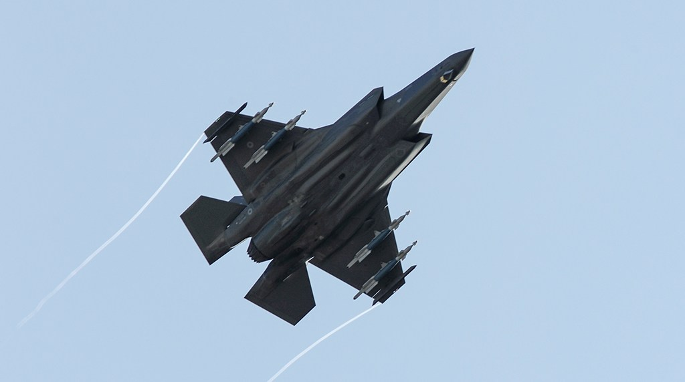

 The F-35B during a short landing in Beast Mode (All images: Italian Air Force)

## Italian Air Force, F-35A and F-35B in “Beast Mode”

On Nov. 26, 2020, the Italian Air Force carried out the first ever training mission with the F-35 in “Beast Mode”. During the test, an F-35A and an F-35B of the 13° Gruppo (Squadron) of the the 32° Stormo (Wing), based at Amendola, in southeastern Italy, flew together with internal and external weapons for the very first time.

The F-35A MM7360/32-10 carried four GBU-12s LGBs (Laser Guided Bombs) on the external pylons and two AIM-120 AMRAAM air-to-air missiles in the weapons bay while the F-35B, MM7453/32-14, carried four GBU-12s. Interestingly, among the images released by the Aeronautica Militare two showed the aircraft flying in formation: the F-35A with the open bays and the F-35B in STOVL (Short Take Off Vertical Landing) mode.

<a href="https://dbagtas.github.io/images/beast-modeF35-2.jpg" class="ui image rounded">
  F-35A carrying four GBU-12s on the external pylons.
</a>

Although we don’t know which was the airspeed of the aircraft when the shots were taken, it’s safe to assume the two 5th gen. jets weren’t too fast: the F-35B had the Upper Lift Fan Door (aka the ‘”scoop” or “toilet seat”) open that acts as a giant speed brake and limits the max airspeed of the F-35. For this reason, the A model must have flown quite slow to allow the B model to catch up and keep the formation: rather impressive considered the payload configuration.

<a href="https://dbagtas.github.io/images/beast-modeF35-3.jpg" class="ui image rounded">
  A pretty unusual formation: F-35B in STOVL mode with gear down and four GBUs flying alongside an F-35A with four GBU-12s and two AIM-120s in the open weapon bays.
</a>

As already explained in details, “Beast Mode” is not an official or technical term, but it has become a pretty common way an F-35 configuration involving both internal and external loads has been dubbed. […] As opposed to a “First Day of War” loadout, in which the F-35 would carry weapons internally to maintain low radar cross-section and observability, the “Third Day of War” configuration is expected to be used from the third day of an air campaign when, theoretically, enemy air defense assets (including sensors, air defense missile and gun systems and enemy aircraft) have been degraded by airstrikes (conducted also by F-35s in “Stealth Mode”) and the battlespace has become more permissive: in such a scenario the F-35 no longer relies on Low-Observability for survivability so it can shift to carrying large external loads. These conditions are not always met. For instance, LO was not needed when the F-35A was called to carry out the first air strike in the Middle East, nor when the U.S. Marine Corps F-35B carried out the first air strike in Afghanistan.

<a href="https://dbagtas.github.io/images/beast-modeF35-4.jpg" class="ui image rounded">
  The F-35B during an approach to Amendola AB in Beast Mode.
</a>

“If requested, within a permissive scenario, the F-35 can be configured in “Beast Mode”, giving up the Low Observability while preserving the sensor fusion, information gathering and information sharing capabilities that allow us to achieve the Information Superiority required effective decision-making capacity at various levels,” told the Commander of the 13th Squadron in an official release.

<a href="https://dbagtas.github.io/images/beast-modeF35-5.jpg" class="ui image rounded">
  Both the F-35A and B of the Italian Air Force are flown by the 13° Gruppo of the 32° Stormo based at Amendola AB.
</a>

The mission on Nov. 26, marked various Italian “firsts”: first sorties in “Beast Mode” for both the F-35A and B model; first formation flying in this configuration for the two types; first short take off and landings for the F-35B in “Beast Mode”. The mission was supported by the Reparto Sperimentale Volo, the Italian Air Force Test Wing, based at Pratica di Mare, as part of the F-35 OT&E (Operational Test and Evaluation), and also by the various ground support teams, who were involved in the preparation and execution of the flights with the peculiar payload config.

“The continuous training of pilots, maintainers and support personnel, also in this configuration, is crucial for the constant growth of the Armed Force in the use of F-35A and F-35B exploiting all their capabilities,” said Col. Stefano Castelnuovo, Commander of the 32nd Wing.

 
