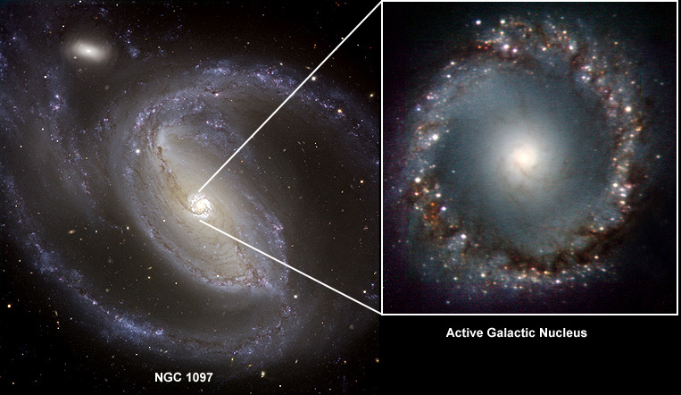
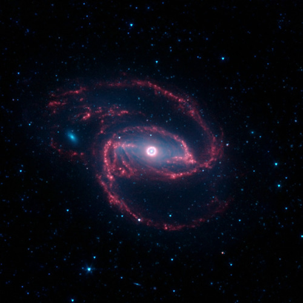
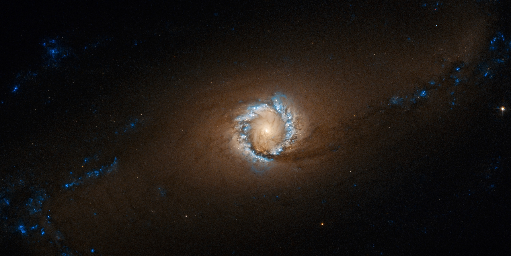

 

NGC 1097 is a Seyfert type galaxy. Deep photographs revealed four narrow optical jets that appear to emanate from the nucleus.

 

The NASA/ESA Hubble Space Telescope provides us with a spectacular image of the bright star-forming ring that surrounds the heart of the barred spiral galaxy NGC 1097. In this image, the larger-scale structure of the galaxy is barely visible: its comparatively dim spiral arms, which surround its heart in a loose embrace, reach out beyond the edges of this frame.

 

## Ring of Fire

The NASA/ESA Hubble Space Telescope provides us with a spectacular image of the bright star-forming ring that surrounds the heart of the barred spiral galaxy NGC 1097. In this image, the larger-scale structure of the galaxy is barely visible: its comparatively dim spiral arms, which surround its heart in a loose embrace, reach out beyond the edges of this frame.

This face-on galaxy, lying 45 million light-years away from Earth in the southern constellation of Fornax (The Furnace), is particularly attractive for astronomers. NGC 1097 is a Seyfert galaxy. Lurking at the very center of the galaxy, a supermassive black hole 100 million times the mass of our sun is gradually sucking in the matter around it. The area immediately around the black hole shines powerfully with radiation coming from the material falling in.

The distinctive ring around the black hole is bursting with new star formation due to an inflow of material toward the central bar of the galaxy. These star-forming regions are glowing brightly thanks to emission from clouds of ionized hydrogen. The ring is around 5000 light-years across, although the spiral arms of the galaxy extend tens of thousands of light-years beyond it.

NGC 1097 has experienced three supernovae (the violent deaths of high-mass stars) in the 11-year span between 1992 and 2003. This is definitely a galaxy worth checking on a regular basis.

The satellite galaxies are NGC 1097A, an elliptical galaxy orbiting 42 000 light-years from the center of NGC 1097 and a small dwarf galaxy named NGC 1097B. Both galaxies are located out beyond the frames of this image and they cannot be seen. Astronomers have indications that NGC 1097 and NGC 1097A have interacted in the past.

This picture was taken with Hubble’s Advanced Camera for Surveys using visual and infrared filters.

 
